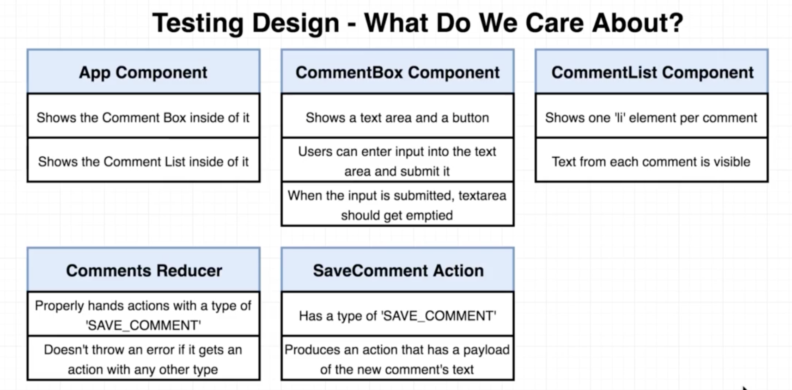

# React Testing

_Reference:_

Udemy course, _Advanced React and Redux_, Stephen Grider

_June 23, 2018_

Contents of create-react-app:

    1.  React
    2.  Webpack - links together JS files
    3.  Babel - turns ES2016/7 and JSX into ES5 compatible code
    4.  Jest - automated test runner

### Dependencies ###
Sec. 2, Lec. 7

Install the following redux dependencies:

    1.  redux (v. 4.0.0)
    2.  react-redux (v. 5.0.7)

```    
    $ npm install --save redux react-redux
```

### React and Redux Design ###
Sec. 2, Lec. 8

The app will contain three React components:

    1.  App - displays the children components
    2.  CommentBox - form for entering and submitting a comment
    3.  CommentList - displays all the comments submitted


The redux store will contain one property of state:

    1.  comments - an array of saved comments

One action will be used:

    2.  saveComment - adds a comment via the 'comments' reducer


### What Do We Test? ###
Sec. 2, Lec. 9

Consider this process when writing tests:

    1.  Look at each individual part of the application:
            - component
            - actions
            - reducers
    2.  Imagine telling friends, "Here's what this code does"
    3.  Write a test to verify that each part does what you expect

Example:

    1.  CommentList Component

        function - displays a list of comments on the screen

        test1 - verify that for every comment, we create exactly
        one element on the screen

    2.  CommentBox Component

        function - comment box displays a text area and submit button

        test1 - verify that component produces a comment box and button
        test2 - verify that when a user clicks the button, the text area is cleared




### Test Structure ###
Sec. 2, Lec. 14

it - global function that contains two parameters:

1.  string - communicates intent of test to yourself and other engineers
2.  function - contains our test logic

React only runs correctly when components are rendered inside a browser.  But when we're running test from the command line, this doesn't occur.  So create-react-app installed a dependency call JSDOM that allows Jest to simulate a runner.

JSDOM creates a new div, stored solely in memory.  Behind the scenes, React will take HTML produced from our React component and place it inside the 'div' element.

### Test Suite Code Cleanup ###

To keep the test suite performing optimally, we need to clean-up the code after the test suite runs:
````
    ReactDOM.unmountComponentAtNode(div)
````

### Test Expectations ###
Sec. 2, Lecs. 17-18

Why would this expectation _not_ be the best approach to testing inside a React app?

```
    const div = document.createElement('div');
    ReactDOM.render(<App />, div);
    expect(div.innerHTML).toContain('Comment Box')
```

_Expectations_
+  The proof behind the code we are testing
+  Every expectation begins with the _expect_ function.  Globally available, no imports required
+  Arguments
    *  The thing (object, array, item, etc.) that we are trying to inspect
    *  Matcher statement - how we are going to test/compare the thing; not all matchers require an argument
    *  Value that we want to see (ideal case)

Answer:
1.  Our <App /> test file is trying to make an assertion about the content of another component, <CommentBox />.  So, if you were to change the contents of CommentBox, it would cause the test for another component to break.
2.  But on larger projects, if you change internal workings of one component and that change affects another component's tests, it will be a recipe for disaster.

_Rule of Thumb_
In component testing, don't access the internal workings or implementation details of another component.

Instead, check to make sure that the other component exists.

How do we fix this test:

```
    
```

### Enzyme ###

Enzyme is a package developed by AirBNB specifically designed to test React components.
We can write tailored expectations for React.

Install the following modules:

``` 
    $  npm install --save enzyme enzyme-adapter-react-16
```

Create file called setupTests.js in src/ directory:

    Jest will execute this file before any other file in code.

    Good place to setup Enzyme before any tests run.


__Enzyme API__

Three methods that create instances of components from which we can write unit tests.

1.  __Static__ - renders given component and returns an object of plain HTML; can't interact with HTML; can only make an assertion of HTML generated.

2.  __Shallow__ - renders _just_ the component, and none of its children; used to test one component in isolation

3.  __Full DOM__ - renders the component and all of its children, plus allows modification afterwards


__August 11, 2018__
To get Jest and Enzyme to play well together:
1. Delete node_modules directory
2. Delete package-lock.json and yarn.lock file
3. Add the following jest dependency in package.json:
        "jest": "23.5.0",
4. Reinstall using npm install
5. Run test with $ npm run test
